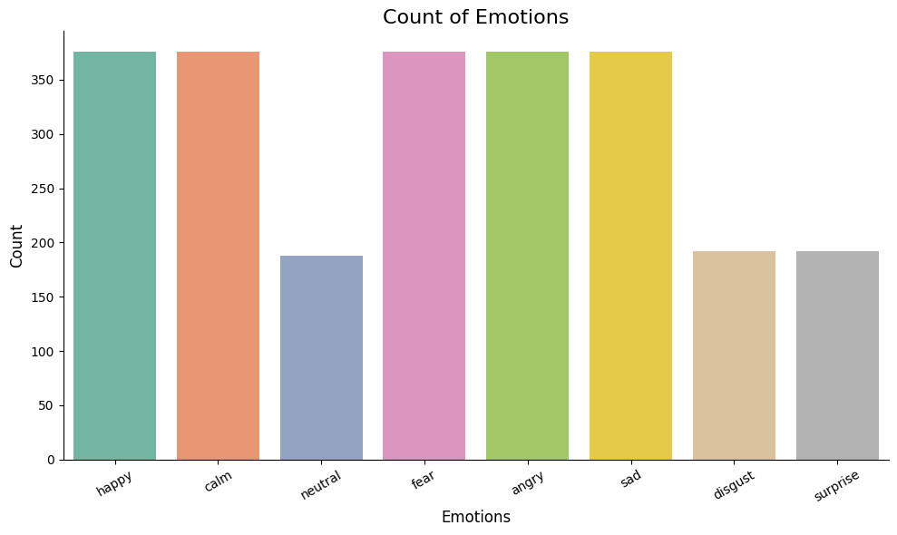
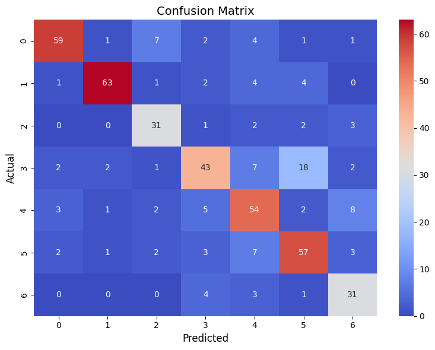
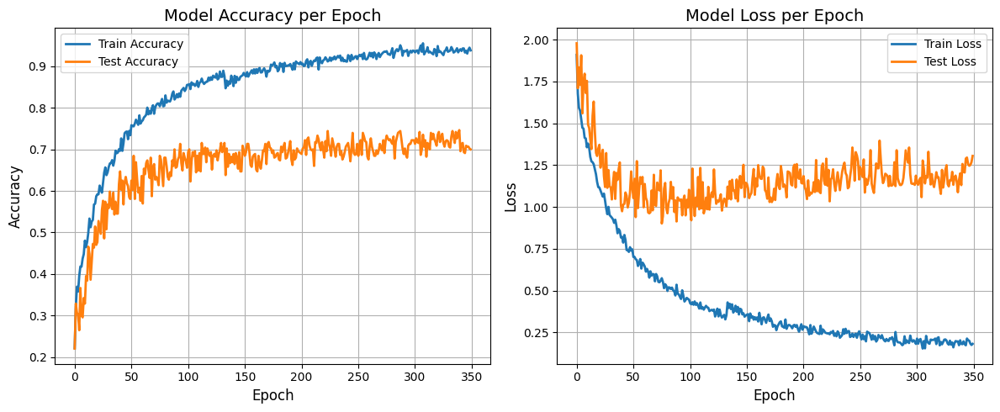

# Speech Emotion Recognition System


link-
https://emotional-classification-speech-processing-beabnry3mfwq4tecsfe.streamlit.app/


A powerful deep learning pipeline for detecting human emotions from speech using a CNN-LSTM model, deployed via an interactive Streamlit web app.

---

## Project Overview

This project implements an **end-to-end Speech Emotion Recognition (SER)** system capable of classifying emotions from short speech samples. The model uses a hybrid **Convolutional Neural Network + Bidirectional LSTM** (CNN-BiLSTM) to capture both spatial and temporal features in audio signals.

### Key Features

* Real-time audio emotion classification via a browser interface
* Clean, elegant UI with waveform visualization
* Robust deep learning backend (CNN + LSTM)
* Supports **8 emotion classes**
* Python test script for command-line predictions

---

## 🎵 Dataset

* **Name:** RAVDESS (Ryerson Audio-Visual Database of Emotional Speech and Song)
* **Download:** [Zenodo Link](https://zenodo.org/record/1188976)
* **Emotions:**

  * Neutral 
  * Calm 
  * Happy 
  * Sad 
  * Angry 
  * Fear 
  * Disgust 
  * Surprise 
* **Total Samples:** 1440 audio files
* **Format:** `.wav`

---

## Model Pipeline

### Data Visualisation
* **Count Emotions:** Count plot to display the counts of all emotions using seaborn
* **Waveform plot:** Defined a waveform plot function to show the waveform of a sample.wav audio
* **Spectrogram plot:** Defined a spectrogram plot function to show the spectrogram of a sample.wav 


### Feature Extraction

> Implemented in both app and test script using `librosa`:

* **Chroma STFT:** Represents harmonic content
* **MFCCs (20):** Capture the short-term power spectrum
* **ZCR:** Measures signal noisiness
* **Mel Spectrogram:** Perceptually scaled frequency energy
* **RMS Energy:** Signal energy amplitude
>Extracted features for the original dataset(combined train and test) and tracked using tqdm


### Data Preprocessing

* **Augmentation:** Defined augmentation functions and applied augmentation only on the train dataset after splitting
Re-extracted features and appended because --->
        the model does not work upon the waveform directly, rather it is trained on extracted features ---> 
        augmentation changes the waveform and hence the features are also changed--->
        extracting final features from train data for the model
* **Oversampling** using SMOTE to handle class imbalance which improves the dataset for better training
* **Normalization** using StandardScaler 
* Normalization (handled within model input)
* **OneHotEncoding** as it is a mutli-class classification problem


### CNN-BiLSTM Architecture

```text
Input Shape: [1, 1, 9, 18]  # channels x features

1. CNN Layers (4 blocks):
   - Conv2D → BatchNorm → ReLU → MaxPool → Dropout

2. LSTM Layers:
   - Bidirectional LSTM (2 layers, hidden size = 128)

3. Classifier:
   - Linear(256 → 256 → 128 → num_classes)
   - ReLU, BatchNorm, Dropout
```

* Final Output: 8 emotion class probabilities
* Loss Function: `NLLLoss`
* Activation: `LogSoftmax`

---

##  Model Performance

| Metric           | Value     |
| ---------------- | --------- |
| Accuracy         | **73.52%**|
| F1 Score         | 75.0%     |
| Lowest Class Acc | 65.0%     |

> Trained on 80-20 split of RAVDESS using AdamW optimizer

## Dropping class 05: NEUTRAL
Clearly  the class 05: NEUTRAL has very low accuracy as well as f1 score, reducing the  overall accuracy of the model,
Hence,We will drop the  NEUTRAL class  and again train the model with num_classes=7

**Data Preprocessing and Feature Extraction with new class_set**
**Re-trained the model adjusting hyperparams**

##  Final Model Performance
 Classification Report:
              precision    recall  f1-score   support

           0       0.82      0.83      0.82        75
           1       0.89      0.83      0.86        75
           2       0.66      0.69      0.68        39
           3       0.71      0.61      0.66        75
           4       0.71      0.67      0.69        75
           5       0.68      0.89      0.77        38
           6       0.69      0.63      0.66        75
           7       0.65      0.85      0.73        39

    accuracy                           0.74       491
   macro avg       0.73      0.75      0.73       491
weighted avg       0.74      0.74      0.73       491


| Metric           | Value     |
| ---------------- | --------- |
| Accuracy         | **74.61%**|
| F1 Score         | 75.0%     |
| Lowest Class Acc | 67.0%     |


**Emotion Count:**


**Confusion Matrix:**


**Model Accuracy and Loss:**
<<<<<<< HEAD
! [Accuracy_Loss](img/Model_accuracy_loss.png)
=======

>>>>>>> 512473cc8904c6f5791a06415d204e28e7257cd0
---


## Web App (Streamlit)

### Features

* Upload `.wav` files and visualize waveform
* Animated emotion prediction badge with emoji
* Confidence score (softmax-based)
* Feature importance bar chart (based on feature groups)

### How It Works Internally

* Reads audio
* Extracts 162-dimensional feature vector
* Reshapes to `[1, 1, 9, 18]` for CNN input
* Predicts and visualizes result

---

## Getting Started

### 1.Clone the Repository

```bash
git clone https://github.com/Alien0nEarth/Emotional-classification-speech-processing.git
cd Emotional-classification-speech-processing
```

---

### 2. Local Installation (Web App)

```bash
cd webapp
pip install -r requirements.txt
streamlit run webapp.py
```

---

### 3. Model Testing (Without UI)

```bash
cd scripts
python test.py
```

Then enter a `.wav` file path when prompted in the terminal.

---

## Web App Usage

> [Launch App](https://emotional-classification-speech-processing-beabnry3mfwq4tecsfe.streamlit.app/)

1. Upload your `.wav` file
2. Wait for real-time waveform + emotion prediction
3. View confidence bar and emotion badge

---

## Repository Structure

```text
Emotional-classification-speech-processing/     
│── img/
│   ├── Confusion_matrix.png
│   ├── Emotions_count.png
│   └── Model_accuracy.png
│
├── LICENSE                       
│
├── model/                        
│   └── best_model.pth
│
├── notebook/                     
│   ├── best_model_training.ipynb
│   ├── df.csv                    
│   ├── features.csv              
│   └── Speech-Emotion-EDA.ipynb
│
├── scripts_python/               
│   ├── model/                    
│   └── test.py                  
│
├── web-app/                     
│   ├── model/                   
│   ├── webapp.py                 
│   └── requirements.txt         
│
├── structure.txt                 
├── README.md                     

```

---

## Demo
----video----


---

##  Notes

* **Class Removal:** Class `06` (Disgust) can be removed in preprocessing/training if desired
* **Feature Size Check:** Make sure the reshaped tensor is `[1, 1, 9, 18]`
* **Streamlit UI:** Responsive layout with animation, emotion-specific styling
* **Deployment:** Easily deploy via Streamlit Cloud or locally

---

## Credits

Developed by **NIKHIL RAJ** ([@Alien0nEarth](https://github.com/Alien0nEarth)) as part of an applied ML project.

Special thanks to RAVDESS creators and open-source contributors!
